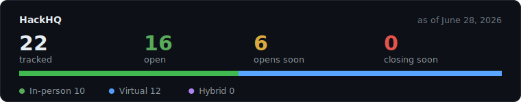
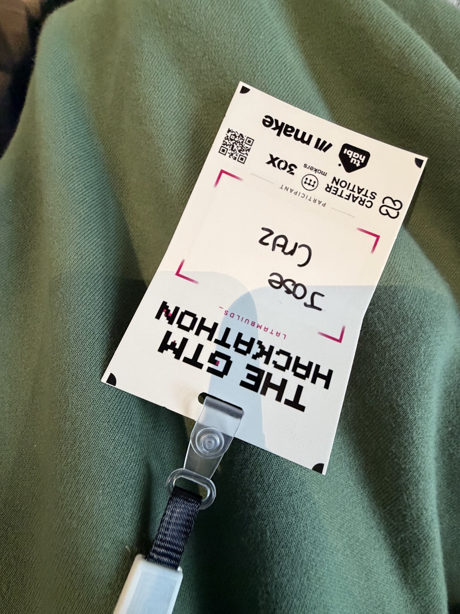
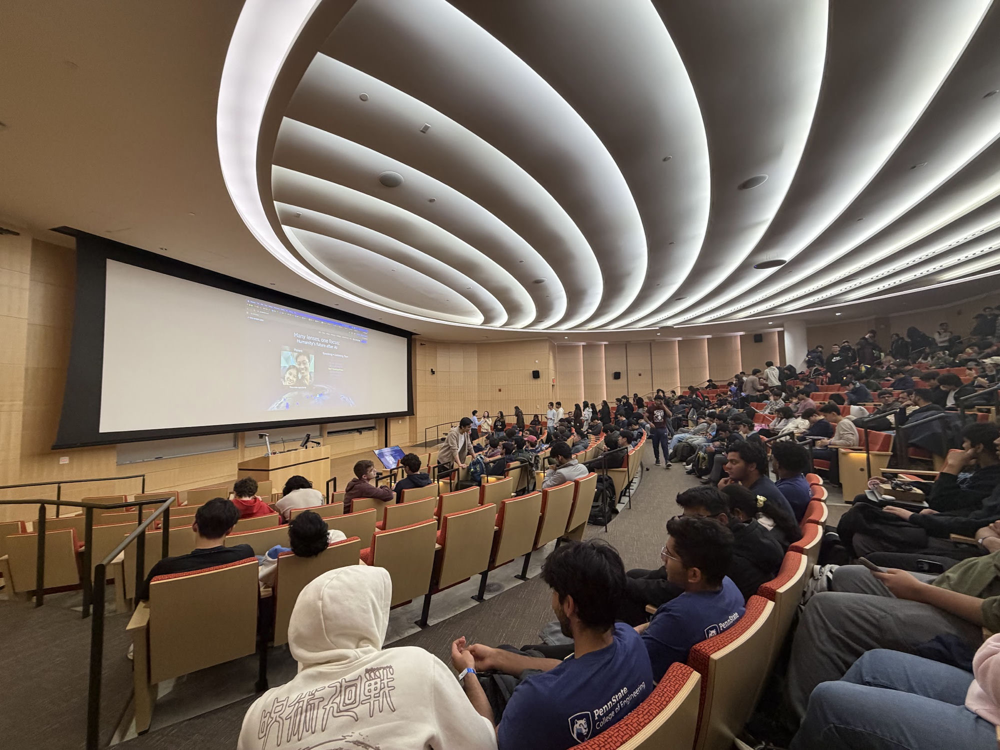
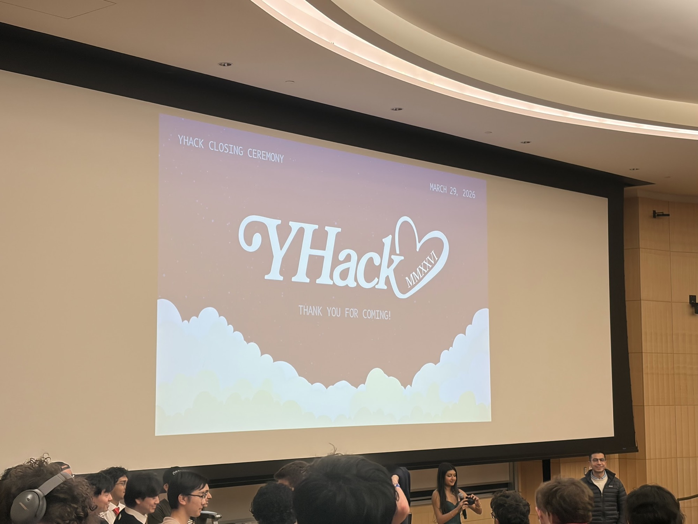
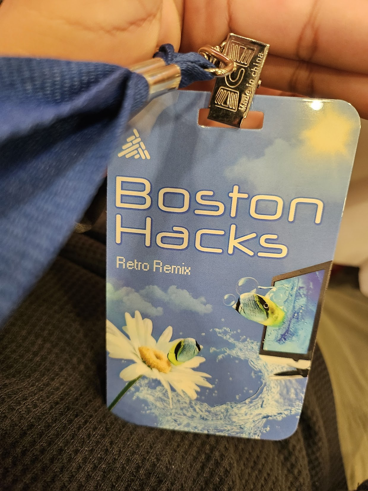
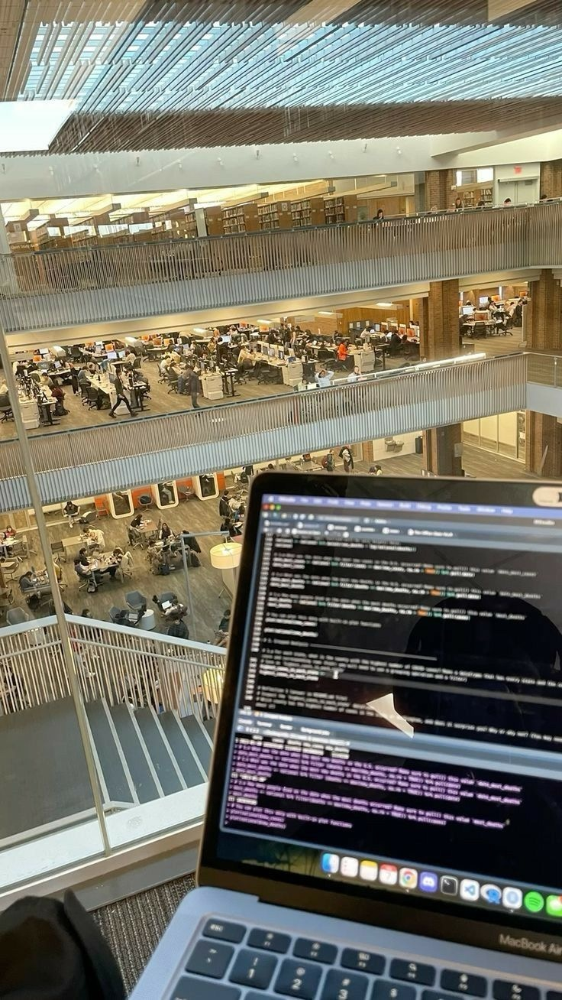

# HackHQ

### Your headquarters for every hackathon worth joining.

## Stats

A snapshot of the list, updated automatically.

> [!IMPORTANT]
> **A single, always-current list of hackathons worth your weekend.** In-person, virtual, and hybrid — college, high-school, and open hackathons all in one place.

Hi, we're [Jose Cruz](https://www.linkedin.com/in/josegaelcruz), [Vick Mahindru](https://www.linkedin.com/in/vickmahindru/), [Cai Zheng](https://www.linkedin.com/in/cai-zheng/), [Allyson Keightley](https://www.linkedin.com/in/allyson-keightley/), and [Henry](https://www.linkedin.com/in/hoanng15/). We built this because hackathon listings are scattered across a dozen sites, Discords, and group chats, and half of them are already over by the time you find them. This one starts from zero and stays current.

Hackathons are the fastest way to build something real, meet your future team, and win prizes while you learn. Everything here is community-driven. If you find one, add it. Together we make the path clearer for everyone who comes after us.

---

**To contribute** — it takes 60 seconds:
 1. [Open an issue](https://github.com/Jose-Gael-Cruz-Lopez/hackhq/issues/new/choose) and paste the hackathon URL
 2. A maintainer approves it
 3. It gets automatically added to the list

---

## Table of Contents

- [Hackathons](#hackathons-1)
- [Resources](#resources)
- [Contributing](#contributing)
- [Acknowledgements](#acknowledgements)
- [Contributors](#contributors)
- [Gallery](#gallery)

## Hackathons

<!-- HACKATHONS_TABLE_START -->
| Status | Host | Hackathon | Format | Location | Prize | Deadline | Application | Date Posted |
| ------ | ---- | --------- | ------ | -------- | ----- | -------- | ----------- | ----------- |
| 🔥 **[CLOSING SOON]** | AITHORS × Okareo | First Ever Agent Evalathon — Jul 6–13, 2026 | Virtual | Online | TBA | Jul 04, 2026 |  | Jul 02, 2026 |
| ✅ **[OPEN]** | Ramp | Builders Cup 2026 (One-Day Hackathon for Students Graduating 2027+) | In-Person | New York, NY | TBA | Jul 17, 2026 |  | Jul 02, 2026 |
| ✅ **[OPEN]** | UMass Amherst | HackUMass XIV (36-Hour Student Hackathon; Pre-Registration Open) | In-Person | Amherst, MA | TBA | — |  | Jul 02, 2026 |
| ✅ **[OPEN]** | Arcangel | Arcangel AI: $1,000,000 IP-A-THON (Early Access; Approval Required) | In-Person | TBA | $1,000,000 | — |  | Jun 29, 2026 |
| ⏳ **[OPENS SOON]** | HackBeanpot | HackBeanpot (Student Hackathon; Next Cycle Not Yet Posted) | In-Person | Boston, MA | TBA | — |  | Jun 29, 2026 |
| ✅ **[OPEN]** | Arya Health | Healthcare Hack NYC (Powered by Arya Health) | In-Person | New York, NY | TBA | — |  | Jun 28, 2026 |
| ✅ **[OPEN]** | Cerebral Valley | The Future of Agentic AI in Healthcare (Abridge × Anthropic × Lightspeed) | In-Person | San Francisco, CA | TBA | — |  | Jun 28, 2026 |
| ✅ **[OPEN]** | MIT | HackMIT 2026 (Weekend Hackathon; Open to Undergrads Worldwide) | In-Person | Cambridge, MA | $20K+ in prizes | Sep 20, 2026 |  | Jun 27, 2026 |
| ✅ **[OPEN]** | Major League Hacking | Global Hack Week: Season Launch — Jul 10–16, 2026 | Virtual | Online | Swag + prizes | Jul 16, 2026 |  | Jun 27, 2026 |
| ✅ **[OPEN]** | Major League Hacking | Midnight Virtual Hackathon — Jul 17–19, 2026 | Virtual | Online | Swag + prizes | Jul 19, 2026 |  | Jun 27, 2026 |
| ✅ **[OPEN]** | Hack the 6ix | Hack the 6ix 2026 — Jul 17–19, 2026 | In-Person | Toronto, ON, Canada | TBA | Jul 19, 2026 |  | Jun 27, 2026 |
| ✅ **[OPEN]** | Hexafalls | Hexafalls 2 — Jul 24–26, 2026 | In-Person | Kolkata, India | TBA | Jul 26, 2026 |  | Jun 27, 2026 |
| ✅ **[OPEN]** | Major League Hacking | Global Hack Week: Agents — Aug 7–13, 2026 | Virtual | Online | Swag + prizes | Aug 13, 2026 |  | Jun 27, 2026 |
| ✅ **[OPEN]** | Major League Hacking | Global Hack Week: Data — Sep 11–17, 2026 | Virtual | Online | Swag + prizes | Sep 17, 2026 |  | Jun 27, 2026 |
| ✅ **[OPEN]** | XPRIZE | Build with Gemini XPRIZE — May 19 – Aug 17, 2026 | Virtual | Online | $2,000,000 | Aug 17, 2026 |  | Jun 27, 2026 |
| ✅ **[OPEN]** | Devpost | H0: Hack the Zero Stack with Vercel v0 and AWS Databases — May 27 – Jun 29, 2026 | Virtual | Online | $80,000 | Jun 29, 2026 |  | Jun 27, 2026 |
| 🔥 **[CLOSING SOON]** | Qwen Cloud | Global AI Hackathon Series with Qwen Cloud — May 26 – Jul 9, 2026 | Virtual | Online | $70,000 | Jul 09, 2026 |  | Jun 27, 2026 |
| ✅ **[OPEN]** | UiPath | UiPath AgentHack — May 15 – Jun 29, 2026 | Virtual | Online | $50,000 | Jun 29, 2026 |  | Jun 27, 2026 |
| ✅ **[OPEN]** | Slack | Slack Agent Builder Challenge — May 20 – Jul 13, 2026 | Virtual | Online | $42,000 | Jul 13, 2026 |  | Jun 27, 2026 |
| ✅ **[OPEN]** | Reddit | Reddit's Games with a Hook Hackathon — Jun 17 – Jul 15, 2026 | Virtual | Online | $40,000 | Jul 15, 2026 |  | Jun 27, 2026 |
| ✅ **[OPEN]** | Arm | Arm Create: AI Optimization Challenge — Jun 4 – Aug 14, 2026 | Virtual | Online | $8,000 | Aug 14, 2026 |  | Jun 26, 2026 |
| ✅ **[OPEN]** | Agentic AI Build Week | Agentic AI Build Week 2026 — Jun 9 – Jul 11, 2026 | In-Person | Galaxy Innovation Park | TBA | Jul 11, 2026 |  | Jun 26, 2026 |
| ✅ **[OPEN]** | Backblaze | Backblaze Generative Media Hackathon: Build with Genblaze on B2 — Jun 22 – Aug 3, 2026 | Virtual | Online | $10,000 | Aug 03, 2026 |  | Jun 26, 2026 |
| ✅ **[OPEN]** | University of Michigan | MHacks 2026 (Student Hackathon; Applications Open) | In-Person | Ann Arbor, MI | $40K+ in prizes | — |  | Jun 26, 2026 |
| ⏳ **[OPENS SOON]** | Freetail Hackers | HackTX 26 (Student Hackathon; Applications Coming Soon) | In-Person | Austin, TX | TBA | — |  | Jun 26, 2026 |
| ⏳ **[OPENS SOON]** | Hackathons @ Berkeley | Cal Hacks (Collegiate Hackathon; 2026 Cycle Not Yet Posted) | In-Person | Berkeley / San Francisco, CA | TBA | — |  | Jun 26, 2026 |
| ⏳ **[OPENS SOON]** | UCLA | LA Hacks (Student Hackathon; Next Event Mid-April 2027) | In-Person | Los Angeles, CA | $60K in prizes | — |  | Jun 26, 2026 |
| ⏳ **[OPENS SOON]** | University of Pennsylvania | PennApps (Student Hackathon; Next Cycle Not Yet Posted) | In-Person | Philadelphia, PA | TBA | — |  | Jun 26, 2026 |
| ⏳ **[OPENS SOON]** | University of Maryland | Bitcamp (Student Hackathon; Next Cycle Not Yet Posted) | In-Person | College Park, MD | TBA | — |  | Jun 26, 2026 |
<!-- HACKATHONS_TABLE_END -->

---

## Resources

- [MLH Official Event Calendar](https://mlh.io/seasons/2026/events) — Major League Hacking's full season schedule
- [Devpost Hackathons](https://devpost.com/hackathons) — online & in-person hackathons with submissions
- [hackathon.com](https://www.hackathon.com/) — global hackathon directory
- [Hackathon Survival Guide](https://github.com/Devang-25/Hackathon-Survival-Guide) — tips for first-timers
- [Archived / Past Hackathons](ARCHIVE.md) — events that have ended (many run annually and reopen next cycle)

---

## Contributing

Please read [CONTRIBUTING.md](CONTRIBUTING.md) before submitting a hackathon!

We welcome contributions from anyone. If you know of a hackathon that isn't listed, please submit an issue.

---

## Acknowledgements

Inspired by [Summer2026-Internships](https://github.com/vanshb03/Summer2026-Internships) by Vansh and the CSCareers community.

---

## Contributors

The **Todd Mafia**, building and maintaining this list 💛

<table>
  <tr>
    <td align="center">
      <a href="https://www.linkedin.com/in/josegaelcruz">
         
        <b>Jose Cruz</b>
      </a>
    </td>
    <td align="center">
      <a href="https://www.linkedin.com/in/vickmahindru/">
         
        <b>Vick Mahindru</b>
      </a>
    </td>
    <td align="center">
      <a href="https://www.linkedin.com/in/cai-zheng/">
         
        <b>Cai Zheng</b>
      </a>
    </td>
    <td align="center">
      <a href="https://www.linkedin.com/in/allyson-keightley/">
         
        <b>Allyson Keightley</b>
      </a>
    </td>
    <td align="center">
      <a href="https://www.linkedin.com/in/hoanng15/">
         
        <b>Henry</b>
      </a>
    </td>
  </tr>
</table>

Want to join this wall? [Add a hackathon](https://github.com/Jose-Gael-Cruz-Lopez/hackhq/issues/new/choose) and you'll be credited as a contributor.

---

Real photos from hackathons people found through this list. Went to one? [Share a photo](https://github.com/Jose-Gael-Cruz-Lopez/hackhq/issues/new?template=gallery_photo.yaml) and it'll show up here.

<!-- GALLERY_START -->

<!-- GALLERY_END -->
